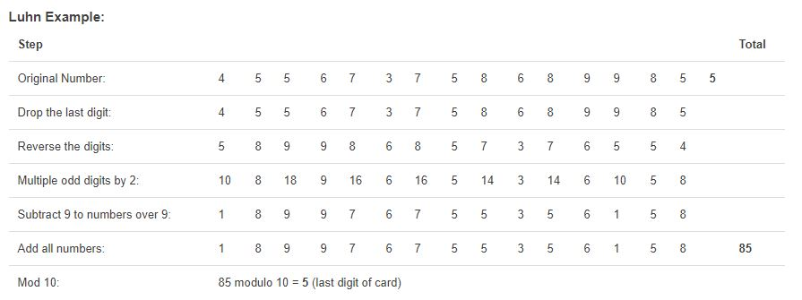

# Project Name
> Credit Card Checker

## General info
One of the challenge projects made up by Codecademy. There were given 7 steps with hints to follow based on the following context: The company that you work for suspects that credit card distributors have been mailing put cards that have invalid numbers. Your goal is to check if credit cards are valid and to optimize the verification process.

## Step by step

//1-2 Look over the starter code.

//3 Create a function that returns true  when an array contains digits of a valid credit card number and false when it is invalid. Use the Luhn algorythm to find out if a credit card is valid or not:

//4 Create another function that checks through the nested array for which numbers are invalid, and returns another nested array of invalid cards.

//5-6 Create a function that has one parameter for a nested array of invalid numbers and returns an array of companies. If First Digit is 3 -> Amex (American Express), 4 -> Visa, 5 -> Mastercard, 6 -> Discover.

//7 Create a function that will convert invalid numbers into valid numbers.

## Technologies
* JavaScript

## Contact
justyna.a.sieczka@gmail.com

